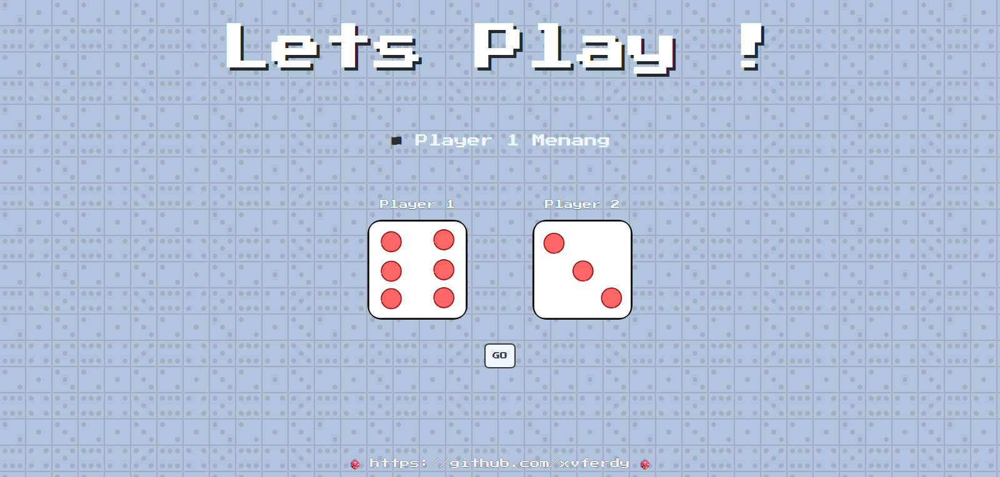

# Dicee Game
## :writing_hand: Konten
- [About The Project](#about-the-project)
- [Notes](#notes)

## About The Project
**Repo ini dibuat untuk:**
- ... Belajar HTML dasar
- ... Belajar CSS dasar
- ... Belajar javascript dasar

**Overview :arrow_heading_down:**


**Dibuat menggunakan:**
- Notepad++
- HTML
- CSS
- Vanilla Javascript

**_Links .._** 
- _See it live! <a href="https://xvferdy.github.io/salary-survey-2019/" target="_blank">Here</a>_
- _Play around with it on <a href="https://codepen.io/xvferdy/pen/mgobPr" target="_blank">CodePen</a>_
    
**_Acknowledgements .._**
- [GitHub Pages](https://pages.github.com)
- [Google Fonts - Press Start 2P](https://fonts.google.com/)

- - -
## Notes
### :closed_book: Catatan
**_1. Event `click`_** 

sᴄʀɪᴘᴛ.ᴊs
```javascript
button.addEventListener('click', function () {
    var randomDadu1 = Math.floor((Math.random() * 6) + 1);
    var randomDadu2 = Math.floor((Math.random() * 6) + 1);

    dadu1.setAttribute('src', 'images/dice' + randomDadu1 + '.png');
    dadu2.setAttribute('src', 'images/dice' + randomDadu2 + '.png');

    if (randomDadu1 > randomDadu2) {
        hasil.innerHTML = '🏴  Player 1 Menang';
    } else if (randomDadu1 < randomDadu2) {
        hasil.innerHTML = 'Player 2 Menang 🏴 ';
    } else {
        hasil.innerHTML = '🚩 Seri !! 🚩';
    }
});
```
